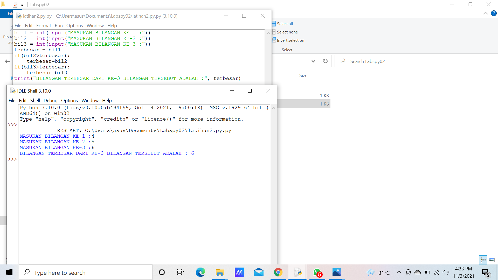

# labspy02
Program input tiga buah bilangan, tampilkan bilangan terbesarnya

1. Buat variabel bil1,bil2, dan bil3.
2. Sertakan input untuk memasukkan bilangan oleh si user
3. Terbesar = bil1
   if bil2 > terbesar
        terbesar = bil2
   if bil3 > terbesar
        terbesar = bil3
4. Cetak bilangan terbesar   

Hasil Input dan Outputnya

